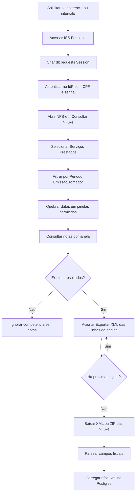
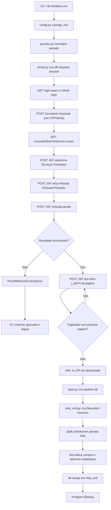

# Automação ISS Fortaleza com DLT-CORE

RPA para acessar portal ISS Fortaleza, consultar NFS-e de servicos prestados por periodo de emissao, baixar o XML de cada NFS-e, extrair os campos fiscais e carregamento no Postgres do Railway usando `dlt`.

## O Que Ela Faz

1. Cria sessao HTTP com `dlt.sources.helpers.requests.Session`.
2. Acessa portal ISS Fortaleza, segue o link OAuth e autentica no IdP/Keycloak com CPF e senha do `.env`.
3. Lista e percorre todas as inscricoes disponiveis quando o usuario logado possui mais de uma empresa.
4. Acessa menu `NFS-e > Consultar NFS-e` por request HTTP.
5. Seleciona `Serviços Prestados` e o filtro `Período Emissão/Tomador` via postbacks JSF.
6. Consulta o periodo em janelas seguras: quando `--inicio/--fim` recebem datas, divide automaticamente em meses e em blocos de ate 31 dias.
7. Localiza as linhas da NFS-e em `consultarnfseForm:dataTable`.
8. Aciona o exportador XML de cada linha (`consultarnfseForm:dataTable:*:j_id374`) por request/postback JSF.
9. Avanca nas paginas do resultado e repete a exportacao por linhas.
10. Baixa os XMLs em `downloads/`; quando houver mais de um arquivo, gera um ZIP local.
11. Entrega o XML/ZIP ao `dlt.sources.filesystem.filesystem`.
12. Usa um `@dlt.transformer` para parsear o XML e normalizar os campos.
13. Carrega a tabela `nfse_xml` no Postgres usando `dlt`.

## Estrutura Do Projeto

```text
.
├── README.md
├── pyproject.toml
├── requirements.txt
├── .env
├── .gitignore
├── downloads/
└── src/
    └── nfs_fortaleza/
        ├── __init__.py
        ├── cli.py
        ├── config.py
        ├── load.py
        ├── nfse_xml.py
        ├── periods.py
        └── portal.py
```

## Arquivos

`README.md`: documentacao do projeto, comandos de uso, regras de negocio e fluxos.

`pyproject.toml`: metadados do pacote Python, dependencias principais e script `nfs-fortaleza`.

`requirements.txt`: lista de dependencias para instalacao direta no `.venv`.

`.env`: variaveis de ambiente com URL do portal, credenciais e conexao Postgres. Este arquivo nao deve ser versionado.

Variaveis opcionais de inscricao para usuarios representantes com mais de uma empresa:

- `INSCRICAO_CNPJ`: escolhe a inscricao pelo CNPJ.
- `INSCRICAO_MUNICIPAL`: escolhe pela inscricao municipal.
- `INSCRICAO_NOME`: escolhe por parte da razao social.

O fluxo principal percorre todas as inscricoes listadas pelo portal. Essas variaveis ficam disponiveis para cenarios em que seja necessario priorizar uma inscricao especifica em rotinas auxiliares.

`.gitignore`: ignora `.env`, `.venv`, downloads, artefatos de debug e caches Python.

`downloads/`: pasta local onde ficam os XMLs baixados do portal.

`src/nfs_fortaleza/cli.py`: interface de linha de comando. Expoe os comandos `run`, `download` e `load-file`.

`src/nfs_fortaleza/config.py`: carrega e normaliza configuracoes do `.env`, incluindo URL do portal e URL Postgres compativel com `dlt`.

`src/nfs_fortaleza/periods.py`: representa e interpreta competencias mensais, como `06/2026`, `2026-06` ou `Junho, 2026`; tambem interpreta datas completas, calcula a data final permitida e quebra intervalos longos em janelas aceitas pelo portal.

`src/nfs_fortaleza/portal.py`: usa `dlt.sources.helpers.requests.Session` para autenticar no portal/IdP, manter cookies, executar os postbacks JSF, abrir a consulta NFS-e, selecionar servicos prestados, filtrar por periodo, percorrer as paginas e baixar o XML via `consultarnfseForm:dataTable:*:j_id374`.

`src/nfs_fortaleza/nfse_xml.py`: define o recurso XML dentro do `dlt`. Usa `dlt.sources.filesystem.filesystem` e um `@dlt.transformer` para ler XML/ZIP, parsear campos da NFS-e, preservar o XML bruto e gerar `row_hash`.

`src/nfs_fortaleza/load.py`: monta o pipeline `dlt`, aponta o destino Postgres e executa `pipeline.run(...)` com o recurso criado em `nfse_xml.py`.

## Uso

Fluxo completo para uma competencia:

```bash
.venv/bin/nfs-fortaleza run --competencia 06/2026
```

Baixar XML sem carregar no banco:

```bash
.venv/bin/nfs-fortaleza download --competencia 06/2026
```

Carregar um XML ou ZIP ja baixado:

```bash
.venv/bin/nfs-fortaleza load-file downloads/nota_5.xml --competencia 06/2026
```

Rodar um intervalo mensal:

```bash
.venv/bin/nfs-fortaleza run --inicio 01/2026 --fim 06/2026
```

Rodar um intervalo de datas maior que 31 dias:

```bash
.venv/bin/nfs-fortaleza run --inicio 01/06/2026 --fim 09/07/2026
```

Baixar XMLs de um intervalo de datas sem carregar no banco:

```bash
.venv/bin/nfs-fortaleza download --inicio 01/06/2026 --fim 09/07/2026
```

## Regra De Negocio

O arquivo gerado deve vir da tela `NFS-e > Consultar NFS-e`, usando o resultado de notas emitidas no periodo solicitado.

Para cada competencia ou janela de datas, a aplicacao:

- seleciona `Serviços Prestados`;
- usa a aba/filtro `Período Emissão/Tomador`;
- preenche `Data de emissão inicial` e `Data de emissão final` com a janela atual;
- limita a data final a data de hoje quando o periodo solicitado esta em andamento;
- submete a consulta por postback JSF;
- identifica cada NFS-e na tabela `Resultado da Consulta`;
- usa o link da linha com `title="Exportar XML"` e acao `consultarnfseForm:dataTable:*:j_id374`;
- faz o postback JSF com o `javax.faces.ViewState` atual;
- avanca no paginador da tabela e repete a exportacao ate a ultima pagina;
- baixa os XMLs e carrega os campos no Postgres.

O portal rejeita consulta com data final maior que hoje, exibindo `Data final da pesquisa não poderá ser superior a data de hoje.`. Por isso, para a competencia corrente, a aplicacao consulta de `01/MM/AAAA` ate a data atual.

O portal tambem limita consultas sem CPF/CNPJ do tomador a no maximo 31 dias, exibindo `Período escolhido para a consulta tem mais de um mês. Escolha um período com no máximo 31 dias ou informe o CPF/CNPJ do tomador.`. Para evitar esse erro, a CLI aceita `--inicio/--fim` como competencias ou datas completas. Quando recebe datas completas, divide automaticamente em janelas por mes e por limite de 31 dias antes de consultar o portal.

Se nenhuma NFS-e for encontrada no periodo, a CLI exibe `Ignorado` e segue para a proxima competencia do intervalo.

## Campos Da Tabela

A tabela principal no Postgres e `nfse_xml`. Entre os campos mapeados estao:

- status, situacao, cancelamento e mensagens de retorno;
- numero da NFS-e, codigo de verificacao, competencia e data/hora;
- RPS e lote de RPS;
- servico, CNAE, item da lista, tributacao, aliquota, discriminacao e municipio;
- prestador, tomador, CPF/CNPJ, inscricao municipal, endereco e contato;
- construcao civil, obra e ART;
- valores do servico, deducoes, retencoes, ISS, base de calculo, descontos e valor liquido;
- `xml_campos`, com flatten do XML;
- `xml_documento`, com o XML original do documento;
- `row_hash`, usado como chave primaria de merge.

A coluna `aliquota` e normalizada para formato decimal com quatro casas. O valor bruto do XML fica em `aliquota_xml`.

## Fluxo De Negocio



## Fluxo Da Aplicacao



## Observacoes Do Portal

O portal e JSF/Seam. O botao geral `Exportar XML das Notas Selecionadas` pode retornar XML vazio se o estado de selecao nao estiver sincronizado no servidor. Por isso a automacao usa o link de exportacao XML da propria linha da NFS-e e submete o formulario com o `javax.faces.ViewState` atual via `dlt.sources.helpers.requests.Session`.

A automacao salva HTML em `.artifacts/` quando ocorre falha de navegacao, login, mudanca de layout ou bloqueio de sessao.
